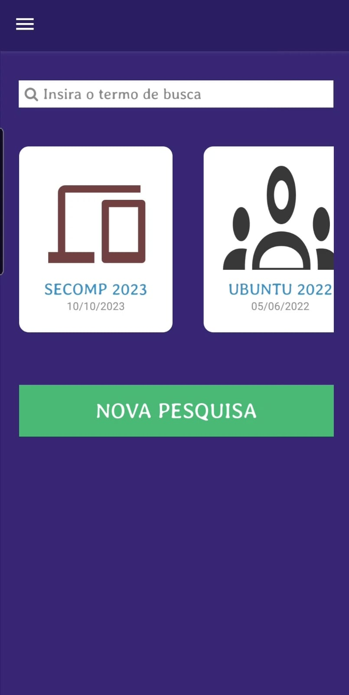
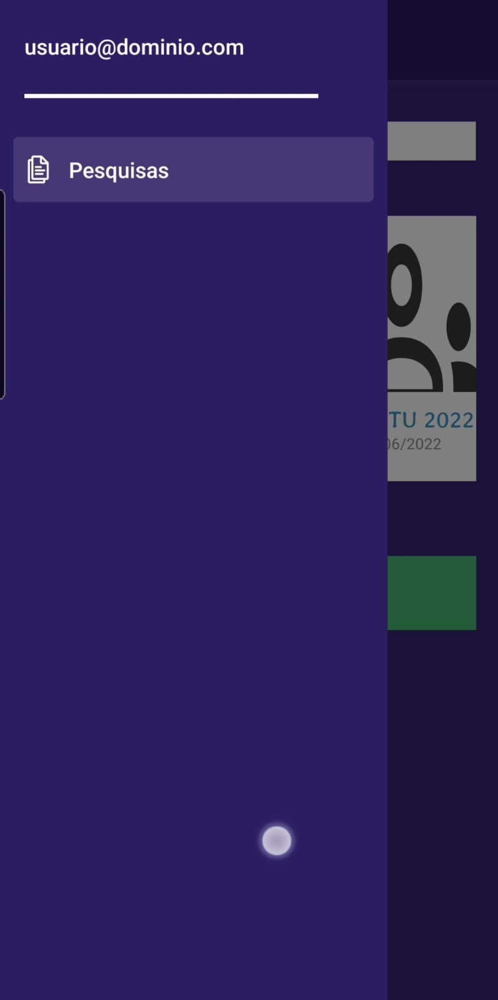
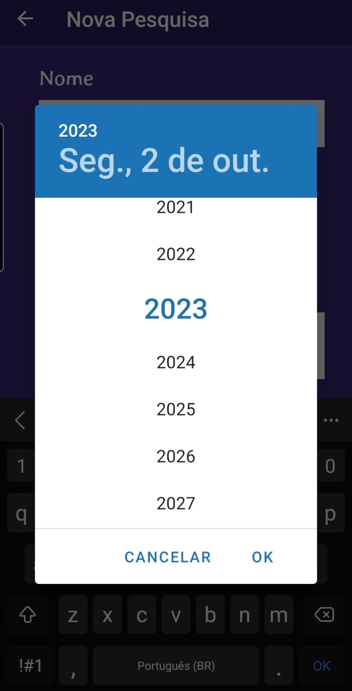

<h1 align="center">
  
</h1>

### Mobile

<h1 align="center">
  
  
  
  
  
  
  
</h1>

## 💻 Sobre o projeto

Satisfying.you é uma plataforma móvel moderna e intuitiva, criada com React Native e Expo, com o objetivo de simplificar o processo de coleta de dados em eventos. Não importa se você está organizando uma conferência, uma feira de exposições ou uma pesquisa de mercado, Satisfying.you está aqui para te ajudar a reunir informações de forma fácil e agradável. 📱💼

### Pré-requisitos

Antes de começar, você vai precisar ter instalado em sua máquina as seguintes ferramentas:
[Node.js](https://nodejs.org/en/)
[VSCode](https://code.visualstudio.com/)

> **Nota**: Tenha certeza que você tem o ambiente necessário para a execução[React Native - Environment Setup](https://reactnative.dev/docs/environment-setup)

## Passo 1 - Configurações

Primeiramente, você precisará startar o **Metro**, o JavaScript bundler .

Par start o metro, rode o seguinte comando na raiz do seu projeto JavaScript:

```bash
# Instale as dependências
$ npm install

# usando npm
$ npm start

# usando Yarn
$ yarn start
```

## Passo 2 - Executando

### Para Android

```bash
# usando npm
$ npm run android

# usando Yarn
$ yarn android
```

### Para IOS

```bash
# usando npm
$ npm run ios

# usando Yarn
$ yarn ios
```

Se tudo estiver configurado _corretamente_, você deverá ver seu novo aplicativo em execução em seu _Android Emulator_ ou _iOS Simulator_ em breve, desde que tenha configurado seu emulador/simulador corretamente.

Esta é uma maneira de executar seu aplicativo – você também pode executá-lo diretamente no Android Studio e no Xcode, respectivamente.

#### Tecnologia - [React Native](http://www.reactnative.com/)

- **[Expo](https://expo.io/)**
- **[React Navigation](https://reactnavigation.org/)**
- **[Expo Constants](https://docs.expo.io/versions/latest/sdk/constants/)**
- **[React Native SVG](https://github.com/react-native-community/react-native-svg)**

## 📝 Licença

Este projeto esta sobe a licença [MIT](./LICENSE).

Feito por Willian Giacomelli 👋🏽 [Entre em contato!](https://www.linkedin.com/in/williangiacomelli/)

---
